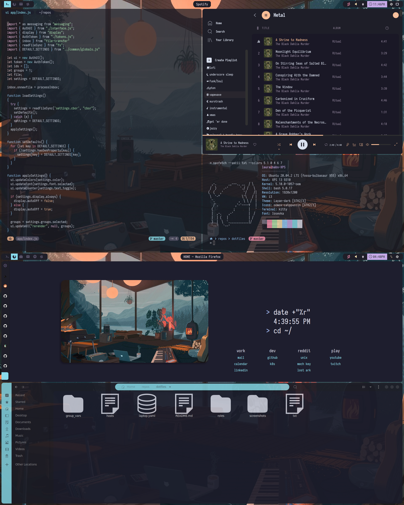

<p align="center">
<b>Dotfiles</b>
</p>



This is a personal collection of configurations, scripts, and otherwise. Mainly used for work and personal laptops.

Setup Summary:
+ **WM**: i3
+ **OS**: ubuntu
+ **Shell**: bash
+ **Terminal**: kitty
+ **Editor**: neovim
+ **File Manager**: nautilus
+ **Launcher**: rofi
+ **Browser**: firefox
+ **Font**: iosevka
+ **Colorscheme**: <a href="https://github.com/catppuccin/catppuccin">catppuccin</a>

Additional links and details below in the *Roles* section.

## Setup

### Install Ansible

Follow <a href="https://docs.ansible.com/ansible/latest/installation_guide/intro_installation.html#installing-ansible-on-ubuntu">installation docs</a> and setup Ansible for fresh systems.

```
$ sudo apt update
$ sudo apt install software-properties-common
$ sudo add-apt-repository --yes --update ppa:ansible/ansible
$ sudo apt install ansible
```

### Run Playbook

To execute all roles (breakdown of roles below) run `ansible-playbook --ask-become-pass -i hosts laptop.yaml`.

To target specific roles add `--tags <rolename>` to the above command.

### Note

All roles are designed to be idempotent/safe to run multiple times but it's always a good idea to back things up! Most configs are driven via symlinks so that changes can be tracked via git and easily pushed upstream.

## Roles

<table>
  <thead>
    <tr>
      <th align="left">Program</th>
      <th align="left" width="150">Name</th>
      <th align="left">Description</th>
    </tr>
  </thead>
  <tbody>
    <tr>
      <td>Shell</td>
      <td><a href="roles/bash">bash</a></td>
      <td>Sets up bash dotfiles.</td>
    </tr>
    <tr>
      <td>Notifications</td>
      <td><a href="roles/dunst">dunst</a></td>
      <td>Installs <a href="https://github.com/dunst-project/dunst">dunst</a>.</td>
    </tr>
    <tr>
      <td>Browser</td>
      <td><a href="roles/firefox">firefox</a></td>
      <td>Sets up firefox and forked <a href="https://github.com/Lixxia/FlyingFox">FlyingFox</a> theme. Contains a few manual items for addons.</td>
    </tr>
    <tr>
      <td>Appearance</td>
      <td><a href="roles/fonts">fonts</a></td>
      <td>Installs <a href="https://typeof.net/Iosevka/">Iosevka</a> Nerdfont.</td>
    </tr>
    <tr>
      <td>Appearance</td>
      <td><a href="roles/gtk">gtk</a></td>
      <td>Setup of custom gtk theme and icons.</td>
    </tr>
    <tr>
      <td>WM</td>
      <td><a href="roles/i3">i3</a></td>
      <td>Setup <a href="https://github.com/Airblader/i3">i3</a> and desktop dependencies.</td>
    </tr>
    <tr>
      <td>Lockscreen</td>
      <td><a href="roles/i3lock">i3lock</a></td>
      <td>Setup <a href="https://github.com/Lixxia/i3lock/">i3lock</a> and auto-run on laptop shut service.</td>
    </tr>
    <tr>
      <td>Terminal</td>
      <td><a href="roles/kitty">kitty</a></td>
      <td>Setup <a href="https://sw.kovidgoyal.net/kitty/index.html">kitty</a> terminal.</td>
    </tr>
    <tr>
      <td>Misc</td>
      <td><a href="roles/misc">misc</a></td>
      <td>Setup common packages, slack, discord, etc.</td>
    </tr>
    <tr>
      <td>Compositor</td>
      <td><a href="roles/picom">picom</a></td>
      <td>Setup <a href="https://github.com/sdhand/picom">picom</a>.</td>
    </tr>
    <tr>
      <td>Bar</td>
      <td><a href="roles/polybar">polybar</a></td>
      <td>Setup <a href="https://github.com/polybar/polybar">polybar</a>.</td>
    </tr>
    <tr>
      <td>Launcher</td>
      <td><a href="roles/rofi">rofi</a></td>
      <td>Setup <a href="https://github.com/davatorium/rofi">rofi</a>.</td>
    </tr>
    <tr>
      <td>Music</td>
      <td><a href="roles/spotify">spotify</a></td>
      <td>Install spotify and theme with <a href="https://github.com/khanhas/spicetify-cli">spicetify</a>.</td>
    </tr>
    <tr>
      <td>Productivity</td>
      <td><a href="roles/synergy">synergy</a></td>
      <td>Guidance for <a href="https://symless.com/synergy">synergy</a> setup.</td>
    </tr>
    <tr>
      <td>Productivity</td>
      <td><a href="roles/touchpad">touchpad</a></td>
      <td>Touchpad tweaks to make it usable.</td>
    </tr>
    <tr>
      <td>Editor</td>
      <td><a href="roles/nvim">nvim</a></td>
      <td>Setup <a href="https://neovim.io/">nvim</a>.</td>
    </tr>
    <tr>
      <td>Editor</td>
      <td><a href="roles/vscode">vscode</a></td>
      <td>Setup <a href="https://code.visualstudio.com/">vscode</a>.</td>
    </tr>
    <tr>
      <td>Appearance</td>
      <td><a href="roles/x">x</a></td>
      <td>Setup a few Xresources/colors that are referenced elsewhere.</td>
    </tr>
  </tbody>
</table>
